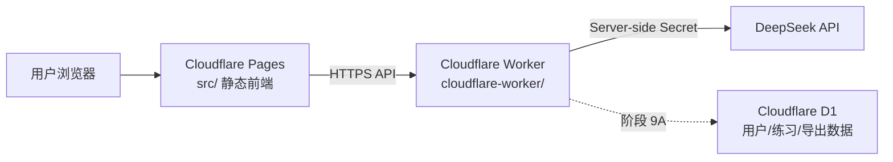
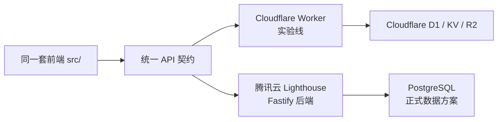

# Cloudflare 实验线实施路线图

## 用途

本文件只服务于当前 Cloudflare 实验仓库：

```text
E:\2025 HKU\Lab\ResilienceProject\Resilience_training_programme_cloudflare_experiment\Resilience_training_programme_cloudflare
```

它用于记录 Cloudflare Pages + Cloudflare Workers 路线的当前阶段、已完成内容、后续用户体系与数据能力设计，以及未来是否可以通过 PR 合回原仓库。

主项目原计划仍然保留：

```text
前端：Vercel / 后续 EdgeOne Pages 或 COS + EdgeOne
后端：腾讯云 Lighthouse + Nginx + systemd
正式 API：api.resilience-training.cloud
```

本路线图不替代主项目正式路线，而是为 Cloudflare 方案提供一条可快速验证、可迁移、可回退的实验线。

---

## 更新记录

- 2026-06-22：完成阶段 9A-1，本地新增 D1 schema 草案、Worker 数据访问层接口与 D1 binding 占位说明；当前尚未要求用户创建 D1 数据库。
- 2026-06-20：建立 Cloudflare 实验线专用路线图，确认当前 Cloudflare 闭环已跑通，并将下一阶段定义为“阶段 9A：用户体系与数据能力最小原型”。

---

## 当前结论

可以先在 Cloudflare 线推进用户体系与数据能力，但建议按“最小原型 + 可迁移 API 契约”的方式做。

原因：

- Cloudflare Pages 前端已可公网访问。
- Cloudflare Worker 后端已可公网 HTTPS 访问。
- Worker 已配置 DeepSeek secret。
- 当前 10 个 AI hook 已通过线上 smoke test，且全部返回 `fallbackUsed: false`。
- 前端已确认能通过 Worker 获得个性化回复。
- 浏览器不再受腾讯云 HTTP 后端 Mixed Content 问题影响。

但需要注意：

- Cloudflare Worker 不是传统 Node.js 长驻服务，不能和 `backend/` 的 Fastify 实现完全共用运行方式。
- Cloudflare 数据能力更适合先用 D1 / KV / R2 等绑定。
- 腾讯云正式后端未来更适合 Fastify + PostgreSQL。
- 因此后端实现会不同，但前端调用的 API 契约应尽量保持一致。

---

## 当前架构



未来与正式线的对应关系：



核心原则：

- 前端尽量只依赖统一 API，不依赖某个云平台。
- Cloudflare Worker 和腾讯云 Fastify 后端可以分别实现同一套 API。
- 用户体系与数据能力先在 Cloudflare 做最小可用验证，再决定是否合回主项目。

---

## 已完成

### Cloudflare 前端

- [x] 使用 Cloudflare Pages 部署 `src/` 静态前端。
- [x] Cloudflare Pages 地址已可访问。
- [x] `src/runtime-config.js` 已默认指向当前 Worker 地址。
- [x] 已确认无 URL 参数时，前端也可以通过 Worker 获得个性化回复。
- [x] 仍保留 `?apiBaseUrl=...` 临时切换后端的能力。

当前前端地址：

```text
https://resilience-training-programme-cloudflare.pages.dev/
```

### Cloudflare Worker 后端

- [x] 新增 `cloudflare-worker/`，不直接改造原 `backend/`。
- [x] 暴露 `GET /health`。
- [x] 暴露 `POST /api/v1/ai/hooks/:hookId`。
- [x] 支持 DeepSeek API 调用。
- [x] 支持 CORS。
- [x] 支持 fallback，避免模型调用失败时前端流程卡住。
- [x] 已迁移当前全部 10 个 AI hook。
- [x] 已新增 `npm run smoke:hooks` 一键线上验证脚本。
- [x] 线上 smoke test 已通过，全部 hook 返回 `fallbackUsed: false`。

当前 Worker 地址：

```text
https://resilience-ai-worker.1362758164.workers.dev
```

当前已迁移 hook：

- `module-1-1.intro-reply`
- `module-1-3.body-sensation-reflection`
- `module-1-3.thought-reflection`
- `module-2-2.case-emotion-feedback`
- `module-3-2.positive-rumination-feedback`
- `module-4-2.thought-train-reflection`
- `module-4-2.boarding-impulse-reflection`
- `module-4-4.label-feedback`
- `module-4-6.supporter-response-feedback`
- `module-6-2.value-desire-insight`

---

## 当前阶段

当前处于：

```text
阶段 9A：Cloudflare 用户体系与数据能力最小原型
```

阶段 7/8 的 Cloudflare 版本已足够支撑阶段 9A：

- [x] 公网前端可访问。
- [x] 公网后端可访问。
- [x] 前后端 HTTPS 联通。
- [x] DeepSeek 真实调用通过。
- [x] 当前 AI hook 线上验证通过。

因此可以开始做用户与数据能力，但先不要做重型账号系统。

---

## 阶段 9A 目标

阶段 9A 的目标不是一次性做完整 SaaS 用户系统，而是先支撑小规模研究使用：

- 能区分不同参与者。
- 能记录参与者每次练习的关键输入、模块、时间。
- 能记录 AI 调用结果与是否 fallback。
- 能按参与者导出数据。
- 不破坏现有固定课程流程。
- 不让前端接触任何密钥。
- 后续可以迁移到腾讯云后端 + PostgreSQL。

推荐身份方案：

```text
邀请码 / 参与者编号 > 账号密码注册
```

理由：

- 更适合小规模研究。
- 不需要邮箱、短信、找回密码。
- 降低隐私和运维复杂度。
- 足够实现多用户隔离和数据导出。

---

## 阶段 9A 数据设计草案

优先记录“研究需要的数据”，避免过度复杂。

### `participants`

参与者表。

建议字段：

- `id`
- `participant_code`
- `display_label`
- `status`
- `created_at`
- `last_seen_at`
- `metadata_json`

### `sessions`

一次浏览器/训练会话。

建议字段：

- `id`
- `participant_id`
- `client_session_id`
- `started_at`
- `last_seen_at`
- `user_agent`
- `metadata_json`

### `module_events`

用户在课程中的关键操作与输入。

建议字段：

- `id`
- `participant_id`
- `session_id`
- `module_id`
- `event_type`
- `step`
- `user_input`
- `choice_value`
- `context_json`
- `created_at`

### `ai_call_events`

AI hook 调用记录。

建议字段：

- `id`
- `participant_id`
- `session_id`
- `module_id`
- `hook_id`
- `variant`
- `user_input`
- `reply_text`
- `fallback_used`
- `prompt_version`
- `provider`
- `model`
- `metadata_json`
- `created_at`

### `exports`

导出任务记录。

建议字段：

- `id`
- `requested_by`
- `format`
- `filters_json`
- `created_at`

---

## 阶段 9A API 契约草案

这些 API 应尽量同时适配 Cloudflare Worker 和未来腾讯云 Fastify 后端。

### 参与者开始或恢复

```text
POST /api/v1/participants/start
```

请求：

```json
{
  "participantCode": "P001",
  "clientSessionId": "browser-generated-session-id"
}
```

返回：

```json
{
  "participantId": "uuid-or-d1-id",
  "participantCode": "P001",
  "sessionId": "session-id"
}
```

### 记录普通模块事件

```text
POST /api/v1/events
```

请求：

```json
{
  "participantCode": "P001",
  "sessionId": "session-id",
  "moduleId": "1-1",
  "eventType": "user_input",
  "step": 1,
  "userInput": "用户输入内容",
  "context": {}
}
```

### AI hook 保持现有接口

```text
POST /api/v1/ai/hooks/:hookId
```

现有接口继续保留，只扩展可选字段：

```json
{
  "participantCode": "P001",
  "sessionId": "session-id",
  "moduleId": "1-1",
  "step": 1,
  "userInput": "用户输入内容",
  "context": {}
}
```

Worker 在返回 AI 回复的同时，可以把调用事件写入 `ai_call_events`。

### 导出数据

阶段 9A 先做简单导出。

```text
GET /api/v1/export?participantCode=P001&format=json
```

后续再扩展：

- CSV
- Excel
- 按时间范围筛选
- 按模块筛选
- 管理员鉴权

---

## Cloudflare 实现建议

阶段 9A 推荐使用：

```text
Cloudflare Worker + D1
```

原因：

- D1 与 Worker 集成简单。
- 适合小规模结构化数据。
- 部署和验证速度快。
- 对当前实验线成本低。

暂不建议一开始就使用：

- 完整账号密码注册
- 复杂管理员后台
- 多角色权限系统
- R2 存储大量文件
- 队列化导出任务

除非后续研究规模明确扩大。

---

## 与腾讯云正式路线的差异

| 项目 | Cloudflare 实验线 | 腾讯云正式线 |
|---|---|---|
| 前端 | Cloudflare Pages | EdgeOne Pages / COS + EdgeOne / Vercel |
| 后端 | Cloudflare Worker | Fastify + Node.js + systemd |
| 数据库 | D1 或外部数据库 | PostgreSQL 优先 |
| 密钥 | Cloudflare Secrets | `.env` / 服务器环境变量 |
| 运行模型 | Serverless request runtime | 长驻 Node 进程 |
| 适合阶段 | 快速验证、小规模实验 | 正式可控部署、长期运维 |

代码差异：

- 前端大部分可以复用。
- API client 可以复用。
- 课程模块逻辑应尽量复用。
- 后端业务逻辑可以共享设计，但 Worker 与 Fastify 的路由、数据库连接、环境变量读取方式会不同。
- 数据 schema 应保持概念一致，但 D1/SQLite 与 PostgreSQL 的迁移语法可能不同。

---

## PR 合回原仓库策略

可以从本 Cloudflare fork 向原仓库发 PR，但要拆分边界。

适合合回的内容：

- `src/` 中平台无关的前端改动。
- 统一 API client。
- 用户体系前端交互。
- 参与者编号/匿名 session 的前端状态管理。
- 平台无关的数据采集点。
- 文档中关于 API 契约和数据模型的设计。
- `cloudflare-worker/` 作为可选实验后端目录。

需要谨慎合回的内容：

- 写死当前 Worker 地址的 `src/runtime-config.js`。
- Cloudflare 专属 D1 binding 配置。
- 只适用于本账号的 `wrangler.toml` 名称、路由、项目名。
- 与主项目正式腾讯云路线冲突的部署说明。

合回建议：

1. 先在 Cloudflare fork 中完成最小原型。
2. 把平台无关前端改动整理成单独 PR。
3. 把 `cloudflare-worker/` 作为可选实验后端单独 PR。
4. 把 `runtime-config.js` 改回可由环境注入，避免原仓库默认指向个人 Worker。
5. 主项目如要使用腾讯云后端，再按同一 API 契约在 `backend/` 中实现 PostgreSQL 版本。

---

## 当前允许改动范围

阶段 9A 允许：

- 新增 Cloudflare D1 schema / migrations。
- 新增 Worker 数据访问层。
- 新增参与者编号启动接口。
- 扩展现有 AI hook 请求体的可选字段。
- 新增事件记录接口。
- 新增最小导出接口。
- 在前端新增轻量参与者编号输入/保存逻辑。
- 在前端关键节点记录模块事件。
- 更新 README 与本路线图。

阶段 9A 暂不主动改动：

- 原有课程文案。
- 现有 UI 视觉风格。
- 现有模块分布。
- 现有 AI hook 的基本返回结构。
- 原 `backend/` 的腾讯云正式路线，除非明确要做双实现。

---

## 测试与验收

每次改动后至少验证：

```bash
cd cloudflare-worker
npm run check
```

Worker 线上验证：

```powershell
npm.cmd run smoke:hooks -- https://resilience-ai-worker.1362758164.workers.dev
```

阶段 9A 增加后，还应验证：

- 输入参与者编号后能创建/恢复参与者。
- 不同参与者编号的数据不会混在一起。
- AI hook 调用后能写入 AI 调用记录。
- 普通模块事件能写入事件表。
- 导出接口能按参与者返回数据。
- 未配置数据库或写入失败时，课程流程不能卡死。

---

## 下一步清单

### 9A-1：设计与本地准备

- [x] 确认身份方案：默认采用参与者编号 / 邀请码。
- [x] 新增 D1 schema 草案：`cloudflare-worker/migrations/0001_research_data.sql`。
- [x] 新增 Worker 数据访问层接口：`cloudflare-worker/src/data/research-repository.ts`。
- [x] 明确数据字段包含参与者编号、session、模块编号、步骤、用户输入、AI 回复、fallback 状态和时间戳。

9A-1 说明：

- D1 schema 已覆盖 `participants`、`sessions`、`module_events`、`ai_call_events`、`exports`。
- Worker 数据访问层提供 D1 与 no-op 双模式：未绑定 D1 时不阻断现有 AI 流程，绑定 D1 后可写入数据。
- 当前只完成本地设计和类型接口，尚未启用线上 D1 写入。

### 9A-2：参与者与 session

- [ ] 新增 `POST /api/v1/participants/start`。
- [ ] 前端新增参与者编号输入或启动流程。
- [ ] 前端保存 `participantCode` 与 `sessionId`。
- [ ] 验证刷新页面后仍能恢复当前参与者上下文。

### 9A-3：事件与 AI 调用记录

- [ ] 新增 `POST /api/v1/events`。
- [ ] AI hook 成功或 fallback 后写入 `ai_call_events`。
- [ ] 选取 1-2 个模块先接入普通事件记录。
- [ ] 验证不影响现有 AI 回复流程。

### 9A-4：导出

- [ ] 新增最小 JSON 导出接口。
- [ ] 后续再评估 CSV / Excel。
- [ ] 验证可按参与者编号导出练习与 AI 调用数据。

### 9A-5：PR 准备

- [ ] 梳理哪些改动可合回原仓库。
- [ ] 移除或参数化个人 Worker 地址。
- [ ] 保持 Cloudflare 专属配置与平台无关逻辑分层。

---

## 后续每轮协作提示

继续推进本 Cloudflare 实验线时，请遵守：

1. 优先保持现有课程流程、文案和 UI 不变。
2. 前端只调用统一 API，不直接接触 DeepSeek 或数据库。
3. Worker 中所有密钥使用 Cloudflare Secret，不写入仓库。
4. 数据能力先以参与者编号和最小事件记录为主，不急于做完整账号系统。
5. 后端实现可以使用 Cloudflare 专属能力，但 API 契约要为腾讯云 Fastify + PostgreSQL 预留迁移空间。
6. 每完成一个阶段或子任务，更新本路线图与 README。
