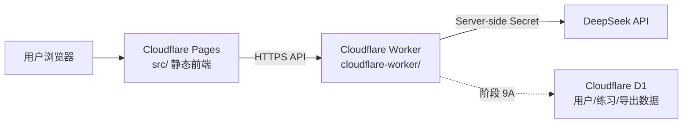
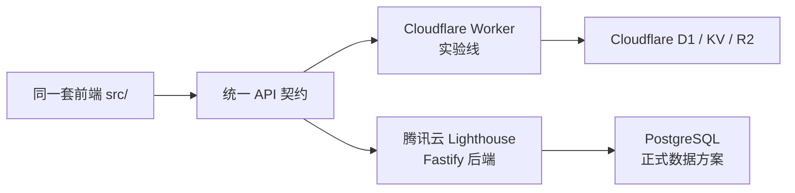

# Cloudflare 实验线实施路线图

## 用途

本文件只服务于当前 Cloudflare 实验仓库：

```text
E:\2025 HKU\Lab\ResilienceProject\Resilience_training_programme_cloudflare_experiment\Resilience_training_programme_cloudflare
```

它用于记录 Cloudflare Pages + Cloudflare Workers 路线的当前阶段、已完成内容、后续用户体系与数据能力设计，以及未来是否可以通过 PR 合回原仓库。

当前执行决定：先以本 Cloudflare 仓库为唯一推进线，完成可供小规模研究使用的初版。原仓库对齐、PR 或整仓合并延后处理，不作为当前初版的阻塞项。

主项目原计划仍然保留：

```text
前端：Vercel / 后续 EdgeOne Pages 或 COS + EdgeOne
后端：腾讯云 Lighthouse + Nginx + systemd
正式 API：api.resilience-training.cloud
```

本路线图不替代主项目正式路线，而是为 Cloudflare 方案提供一条可快速验证、可迁移、可回退的实验线。

---

## 更新记录

- 2026-08-24：根据 Resilience program 收尾.docx 更新初版收尾基线：正式参与者采用“研究编号 + 姓名、无密码、首次直接创建/后续恢复”，不再要求邮箱或预录入名单；解锁改为“完成第 N 天后，次日 00:00 解锁第 N+1 天”；初版必须记录日期、开始/结束时间、总时长和用户输入/选择；补充所有模块预计时长、统一完成提示、行为数据增强项、导出与发布验收清单。当前先完成 Cloudflare 初版，再考虑与原仓库合并。

- 2026-06-22：根据验证需求调整 9A-2：前端改为强制登录浮层，输入研究编号、姓名、邮箱（邮箱可空）；Worker 增加预录入名单校验，默认测试账号为 `C_TEST/sxq`（全模块解锁）和 `C_LIMIT/sxq`（逐日解锁）。
- 2026-06-22：完成阶段 9A-2 前端最小接入：新增首页研究编号输入/保存/恢复，AI hook 请求会携带 `participantCode` 与后端 `sessionId`；前端读取 `access` 字段进行逐日解锁展示，tester/admin 可访问全部模块。
- 2026-06-22：补充阶段 9A 研究数据要求：参与者编号支持 `C0001` 这类字母+数字格式；`Cloudflare D1` 是数据库产品名，不是参与者编号；预留邮箱/手机号绑定、逐日解锁、测试/管理员账号绕过解锁、完整对话 transcript 与 CSV/Excel 导出字段。
- 2026-06-22：推进阶段 9A-2，新增 `POST /api/v1/participants/start` 后端接口和 `smoke:participant` 验证脚本；前端参与者编号输入仍待接入。
- 2026-06-22：完成阶段 9A-1，本地新增 D1 schema 草案、Worker 数据访问层接口与 D1 binding 占位说明；当前尚未要求用户创建 D1 数据库。
- 2026-06-20：建立 Cloudflare 实验线专用路线图，确认当前 Cloudflare 闭环已跑通，并将下一阶段定义为“阶段 9A：用户体系与数据能力最小原型”。

---

## 当前结论

当前先在 Cloudflare 线完成用户体系、进度解锁、研究数据记录和导出，形成可验收的初版。完成初版前不处理与原仓库的代码合并，只继续保持 API 契约和数据模型可迁移。

原因：

- Cloudflare Pages 前端已可公网访问。
- Cloudflare Worker 后端已可公网 HTTPS 访问。
- Worker 已配置 DeepSeek secret。
- 当前 10 个 AI hook 已通过线上 smoke test，且全部返回 `fallbackUsed: false`。
- 前端已确认能通过 Worker 获得个性化回复。
- 浏览器不再受腾讯云 HTTP 后端 Mixed Content 问题影响。

但需要注意：

- Cloudflare Worker 不是传统 Node.js 长驻服务，不能和 `backend/` 的 Fastify 实现完全共用运行方式。
- Cloudflare 数据能力更适合先用 D1 / KV / R2 等绑定。
- 腾讯云正式后端未来更适合 Fastify + PostgreSQL。
- 因此后端实现会不同，但前端调用的 API 契约应尽量保持一致。

---

## 当前架构


```mermaid
flowchart LR
    U["用户浏览器"] --> F["Cloudflare Pages<br/>src/ 静态前端"]
    F -->|"HTTPS API"| W["Cloudflare Worker<br/>cloudflare-worker/"]
    W -->|"Server-side Secret"| DS["DeepSeek API"]
    W -. "阶段 9A" .-> D1["Cloudflare D1<br/>用户/练习/导出数据"]
```

未来与正式线的对应关系：


```mermaid
flowchart LR
    F["同一套前端 src/"] --> API["统一 API 契约"]
    API --> CW["Cloudflare Worker<br/>实验线"]
    CW --> D1["Cloudflare D1 / KV / R2"]
    API --> VM["腾讯云 Lighthouse<br/>Fastify 后端"]
    VM --> PG["PostgreSQL<br/>正式数据方案"]
```

核心原则：

- 前端尽量只依赖统一 API，不依赖某个云平台。
- Cloudflare Worker 和腾讯云 Fastify 后端可以分别实现同一套 API。
- 用户体系与数据能力先在 Cloudflare 做成可用初版，再决定是否合回主项目。
- 初版收尾期间，Cloudflare 仓库是需求、代码和进度状态的唯一基线。

---

## 已完成

### Cloudflare 前端

- [x] 使用 Cloudflare Pages 部署 `src/` 静态前端。
- [x] Cloudflare Pages 地址已可访问。
- [x] `src/runtime-config.js` 已默认指向当前 Worker 地址。
- [x] 已确认无 URL 参数时，前端也可以通过 Worker 获得个性化回复。
- [x] 仍保留 `?apiBaseUrl=...` 临时切换后端的能力。
- [x] 首页已新增研究编号输入与本地保存/恢复。
- [x] AI hook 请求已携带参与者编号与后端 session 信息。
- [x] 前端已读取后端 `access` 字段，为逐日解锁与 tester/admin 全模块访问做准备。

当前前端地址：

```text
https://resilience-training-programme-cloudflare.pages.dev/
```

### Cloudflare Worker 后端

- [x] 新增 `cloudflare-worker/`，不直接改造原 `backend/`。
- [x] 暴露 `GET /health`。
- [x] 暴露 `POST /api/v1/ai/hooks/:hookId`。
- [x] 支持 DeepSeek API 调用。
- [x] 支持 CORS。
- [x] 支持 fallback，避免模型调用失败时前端流程卡住。
- [x] 已迁移当前全部 10 个 AI hook。
- [x] 已新增 `npm run smoke:hooks` 一键线上验证脚本。
- [x] 线上 smoke test 已通过，全部 hook 返回 `fallbackUsed: false`。

当前 Worker 地址：

```text
https://resilience-ai-worker.1362758164.workers.dev
```

当前已迁移 hook：

- `module-1-1.intro-reply`
- `module-1-3.body-sensation-reflection`
- `module-1-3.thought-reflection`
- `module-2-2.case-emotion-feedback`
- `module-3-2.positive-rumination-feedback`
- `module-4-2.thought-train-reflection`
- `module-4-2.boarding-impulse-reflection`
- `module-4-4.label-feedback`
- `module-4-6.supporter-response-feedback`
- `module-6-2.value-desire-insight`

---

## 当前阶段

当前处于：

```text
阶段 9A 收尾：Cloudflare 初版用户体系、进度解锁、研究数据与导出
```

阶段 7/8 的 Cloudflare 版本已足够支撑阶段 9A：

- [x] 公网前端可访问。
- [x] 公网后端可访问。
- [x] 前后端 HTTPS 联通。
- [x] DeepSeek 真实调用通过。
- [x] 当前 AI hook 线上验证通过。

因此可以开始做用户与数据能力，但先不要做重型账号系统。

---

## 阶段 9A 目标

阶段 9A 的目标不是一次性做完整 SaaS 用户系统，而是先支撑小规模研究使用：

- 能区分不同参与者。
- 能记录参与者每次练习的关键输入、模块、时间。
- 能记录 AI 调用结果与是否 fallback。
- 能按参与者导出数据。
- 不破坏现有固定课程流程。
- 不让前端接触任何密钥。
- 后续可以迁移到腾讯云后端 + PostgreSQL。

推荐身份方案：

```text
邀请码 / 参与者编号 > 账号密码注册
```

理由：

- 更适合小规模研究。
- 不需要邮箱、短信、找回密码。
- 降低隐私和运维复杂度。
- 足够实现多用户隔离和数据导出。

当前编号与解锁规则：

- Cloudflare D1 是数据库产品名，不是参与者编号。
- 正式参与者输入研究编号和姓名，无需密码、邮箱或预录入名单。
- 第一次输入某组编号和姓名时创建参与者，后续相同组合恢复历史进度。
- Worker 统一规范研究编号格式；姓名保留原始显示值，并使用规范化值进行身份匹配。
- 新参与者只解锁第 1 天。完成第 N 天后，第 N+1 天在 Asia/Shanghai 时区的次日 00:00 解锁。
- tester/admin 由 Worker 环境变量配置，仅用于内部全模块测试；前端不能自行决定权限。
- 9A-1 已完成身份入口与参与者联合身份改造；unlock_start_at 仍是临时解锁依据，需在 9A-3 改为基于日完成状态和 Asia/Shanghai 次日 00:00 的解锁逻辑。
---

## 阶段 9A 数据设计草案

优先记录“研究需要的数据”，避免过度复杂。

### `participants`

参与者表。

建议字段：

- `id`
- `participant_code`
- `display_label`
- `account_email`
- `account_phone`
- `role`
- `unlock_start_at`
- `status`
- `created_at`
- `last_seen_at`
- `metadata_json`

### `sessions`

一次浏览器/训练会话。

建议字段：

- `id`
- `participant_id`
- `client_session_id`
- `started_at`
- `last_seen_at`
- `ended_at`
- `duration_seconds`
- `user_agent`
- `metadata_json`

### `module_events`

用户在课程中的关键操作与输入。

建议字段：

- `id`
- `participant_id`
- `session_id`
- `module_id`
- `event_type`
- `step`
- `user_input`
- `choice_value`
- `context_json`
- `created_at`

### `conversation_messages`

完整对话 transcript 表，用于后续导出“用户看到/输入/收到”的文本序列。

建议字段：

- `id`
- `participant_id`
- `session_id`
- `module_id`
- `hook_id`
- `message_role`
- `message_text`
- `source`
- `step`
- `sequence_index`
- `duration_ms`
- `metadata_json`
- `created_at`

### `ai_call_events`

AI hook 调用记录。

建议字段：

- `id`
- `participant_id`
- `session_id`
- `module_id`
- `hook_id`
- `variant`
- `user_input`
- `reply_text`
- `fallback_used`
- `prompt_version`
- `provider`
- `model`
- `metadata_json`
- `created_at`

### `exports`

导出任务记录。

建议字段：

- `id`
- `requested_by`
- `format`
- `filters_json`
- `created_at`

---

## 阶段 9A API 契约草案

这些 API 应尽量同时适配 Cloudflare Worker 和未来腾讯云 Fastify 后端。

### 参与者开始或恢复

```text
POST /api/v1/participants/start
```

请求：

```json
{
  "participantCode": "C0001",
  "clientSessionId": "browser-generated-session-id",
  "participantName": "参与者姓名",
}
```

返回：

```json
{
  "participantId": "uuid-or-d1-id",
  "participantCode": "C0001",
  "participantName": "参与者姓名",
  "sessionId": "session-id",
  "role": "participant",
  "lastCompletedDayIndex": 0,
  "nextUnlockAt": null,
  "access": {
    "canAccessAllModules": false,
    "unlockedDayIndex": 1
  }
}
```

### 记录普通模块事件

```text
POST /api/v1/events
```

请求：

```json
{
  "participantCode": "P001",
  "sessionId": "session-id",
  "moduleId": "1-1",
  "eventType": "user_input",
  "step": 1,
  "userInput": "用户输入内容",
  "context": {}
}
```

### AI hook 保持现有接口

```text
POST /api/v1/ai/hooks/:hookId
```

现有接口继续保留，只扩展可选字段：

```json
{
  "participantCode": "P001",
  "sessionId": "session-id",
  "moduleId": "1-1",
  "step": 1,
  "userInput": "用户输入内容",
  "context": {}
}
```

Worker 在返回 AI 回复的同时，可以把调用事件写入 `ai_call_events`。

### 导出数据

初版优先提供受管理员鉴权保护的 CSV 导出；JSON 保留为调试和后续数据处理格式。

```text
GET /api/v1/export?participantCode=P001&format=csv
```

后续再扩展：

- CSV
- Excel
- 按时间范围筛选
- 按模块筛选
- 管理员鉴权

导出字段优先级：

- 参与者编号与内部 `participant_id`。
- 参与者姓名；邮箱/手机号字段仅作为未来兼容预留，不纳入初版登录和导出必填项。
- session ID、开始时间、结束时间、时长。
- 模块编号、步骤、事件类型。
- 完整对话文字，包括固定脚本文案、用户输入、AI 回复。
- AI hook 信息，包括 `hook_id`、provider、model、fallback 状态、时间戳。
- 后续 CSV/Excel 可以从同一套 JSON 数据整理生成。

---

## Cloudflare 实现建议

阶段 9A 推荐使用：

```text
Cloudflare Worker + D1
```

原因：

- D1 与 Worker 集成简单。
- 适合小规模结构化数据。
- 部署和验证速度快。
- 对当前实验线成本低。

暂不建议一开始就使用：

- 完整账号密码注册
- 复杂管理员后台
- 多角色权限系统
- R2 存储大量文件
- 队列化导出任务

除非后续研究规模明确扩大。

---

## 与腾讯云正式路线的差异

| 项目 | Cloudflare 实验线 | 腾讯云正式线 |
|---|---|---|
| 前端 | Cloudflare Pages | EdgeOne Pages / COS + EdgeOne / Vercel |
| 后端 | Cloudflare Worker | Fastify + Node.js + systemd |
| 数据库 | D1 或外部数据库 | PostgreSQL 优先 |
| 密钥 | Cloudflare Secrets | `.env` / 服务器环境变量 |
| 运行模型 | Serverless request runtime | 长驻 Node 进程 |
| 适合阶段 | 快速验证、小规模实验 | 正式可控部署、长期运维 |

代码差异：

- 前端大部分可以复用。
- API client 可以复用。
- 课程模块逻辑应尽量复用。
- 后端业务逻辑可以共享设计，但 Worker 与 Fastify 的路由、数据库连接、环境变量读取方式会不同。
- 数据 schema 应保持概念一致，但 D1/SQLite 与 PostgreSQL 的迁移语法可能不同。

---

## PR 合回原仓库策略

可以从本 Cloudflare fork 向原仓库发 PR，但要拆分边界。

适合合回的内容：

- `src/` 中平台无关的前端改动。
- 统一 API client。
- 用户体系前端交互。
- 参与者编号/匿名 session 的前端状态管理。
- 平台无关的数据采集点。
- 文档中关于 API 契约和数据模型的设计。
- `cloudflare-worker/` 作为可选实验后端目录。

需要谨慎合回的内容：

- 写死当前 Worker 地址的 `src/runtime-config.js`。
- Cloudflare 专属 D1 binding 配置。
- 只适用于本账号的 `wrangler.toml` 名称、路由、项目名。
- 与主项目正式腾讯云路线冲突的部署说明。

合回建议：

1. 先在 Cloudflare fork 中完成最小原型。
2. 把平台无关前端改动整理成单独 PR。
3. 把 `cloudflare-worker/` 作为可选实验后端单独 PR。
4. 把 `runtime-config.js` 改回可由环境注入，避免原仓库默认指向个人 Worker。
5. 主项目如要使用腾讯云后端，再按同一 API 契约在 `backend/` 中实现 PostgreSQL 版本。

---

## 当前允许改动范围

阶段 9A 允许：

- 新增 Cloudflare D1 schema / migrations。
- 新增 Worker 数据访问层。
- 新增参与者编号启动接口。
- 扩展现有 AI hook 请求体的可选字段。
- 新增事件记录接口。
- 新增最小导出接口。
- 在前端新增轻量参与者编号输入/保存逻辑。
- 在前端关键节点记录模块事件。
- 更新 README 与本路线图。

阶段 9A 暂不主动改动：

- 原有课程文案。
- 现有 UI 视觉风格。
- 现有模块分布。
- 现有 AI hook 的基本返回结构。
- 原 `backend/` 的腾讯云正式路线，除非明确要做双实现。

---

## 测试与验收

每次改动后至少验证：

```bash
cd cloudflare-worker
npm run check
```

Worker 线上验证：

```powershell
npm.cmd run smoke:hooks -- https://resilience-ai-worker.1362758164.workers.dev
```

阶段 9A 增加后，还应验证：

- 输入参与者编号后能创建/恢复参与者，刷新页面后编号仍显示。
- 普通编号默认只解锁第 1 天，后续模块显示“第 N 天解锁”。
- tester/admin 编号在 Worker 环境变量配置并部署后，可以访问全部模块。
- 不同参与者编号的数据不会混在一起。
- AI hook 调用后能写入 AI 调用记录。
- 普通模块事件能写入事件表。
- 导出接口能按参与者返回数据。
- 未配置数据库或写入失败时，课程流程不能卡死。

---

## 2026-08-24 初版收尾需求基线

本节是当前初版的权威需求基线。后文保留的邮箱、预录入名单、按注册时间自动逐日解锁等描述属于历史方案；后续实现和验收以本节及“当前执行清单”为准。

### 正式参与者身份

- 登录只保留“研究编号 + 姓名”，不设置密码，不要求邮箱，不需要个人主页。
- 第一次使用某组研究编号和姓名时直接创建参与者；后续输入相同组合时恢复同一参与者和历史进度。
- 初版按标准化后的 participantCode + participantName 识别参与者。输入不同组合时视为另一参与者，因此不会看到原进度。
- tester/admin 继续作为内部测试能力保留，但不能由前端自行声明，也不出现在正式参与者说明中。

### 登录后的温馨提示

登录成功后展示一次说明页；如果独立说明页实现成本过高，可以放在登录界面下方并要求参与者确认后进入：

1. 每次练习请选择一段不会被打扰的时间，并在安静、放松的私人空间内进行。
2. 部分训练模块会播放音频，请提前调整设备音量，并确认当前环境能够清晰听到声音。
3. 平台会记录每次练习的总用时，以及训练过程中的部分操作数据，用于研究分析。

上线前由研究团队最终确认隐私和知情说明文字。用户自由输入可能包含敏感内容，因此不能直接承诺“不会涉及个人隐私”，应准确说明记录范围、用途、访问权限和保存期限。

### 模块解锁规则

- 新参与者默认只解锁第 1 天模块。
- 完成第 N 天模块后，不立即开放第 N+1 天。
- 第 N+1 天在完成后的下一个自然日 00:00 解锁，时区固定为 Asia/Shanghai。
- 如果第 N 天未完成，第 N+1 天不能仅因时间经过而自动解锁。
- 重复提交完成事件必须幂等，不能重复推进进度或生成多条完成记录。

### 初版必须保存的数据

- 参与者研究编号和姓名。
- 当天日期、模块编号。
- 模块开始时间、结束时间和总用时。
- 用户点击选择的内容和主动输入的内容。
- AI hook 回复、fallback 状态、provider/model 和时间戳。

完整固定脚本对话不是初版硬性要求；现有 conversation_messages 结构可以保留，但不得阻塞初版发布。

### 可选行为数据

核心流程稳定后再接入，不作为首轮 D1 上线的阻塞项：

- 短时间内快速连续点击“继续”。
- 超过 5 分钟无操作。
- 页面进入后台、窗口最小化或切换标签页。

行为数据只记录事件类型、发生时间、模块和必要时长，不记录与研究无关的浏览器内容。

### 课程体验收尾

- 每个模块开头或题目区域显示“本模块完成预计需要 XX 分钟”。
- 预计时长必须先形成 42 个模块的确认清单，不能由代码自行猜测。
- 每个模块完成时统一显示“本次练习已完成。”。
- 优先通过统一模块完成机制实现，不在 42 个模块中分别复制结束逻辑。
- 1-5 必须补上明确结束提示，并纳入统一完成事件。

### 导出与管理边界

- 初版至少提供 CSV 导出，可直接由 Excel 打开；JSON 可保留为调试或内部接口格式。
- 导出支持按参与者、日期范围和模块筛选。
- 导出接口必须由 Worker Secret 或等价管理员凭证保护。
- 初版不开发个人主页、复杂管理后台、密码找回、短信或邮箱验证。

---

## 当前执行清单（2026-08-24）

### 9A-0：固化当前工作区成果

- [x] Cloudflare Pages 前端和 Worker 已部署并通过 HTTPS 联通。
- [x] 当前 10 个 AI hook 已迁移到 Worker，并保留 fallback。
- [x] 已有强制登录浮层、参与者本地 session、AI 请求身份字段和模块锁定态原型。
- [x] 已有 D1 migration 草案、D1/no-op repository 骨架和参与者 start API 原型。
- [ ] 将当前 12 个已修改文件和未跟踪的 src/js/services/participantSession.js 整理成一个可回退的基线提交。
- [x] 提交前再次运行 Worker 类型检查和前端语法检查，记录当前可用状态。

完成标准：当前成果不再只存在于本地脏工作区，后续每个阶段可以独立回退和核对。

### 9A-1：按最终需求调整登录与参与者身份

- [x] 前端登录表单移除邮箱，仅保留研究编号和姓名。
- [x] Worker 移除正式参与者的 PARTICIPANT_ALLOWLIST 强制校验。
- [x] 首次使用 participantCode + participantName 时创建参与者，再次输入相同组合时恢复原参与者。
- [x] 调整 D1 唯一约束和查询逻辑，使身份组合与产品规则一致。
- [x] 保留 tester/admin 环境变量配置，仅用于内部全模块测试。
- [x] 登录后展示温馨提示，并要求用户确认后进入课程。
- [x] 刷新页面能够恢复登录；“更换信息”只清理本地会话，不删除服务端历史。
- [x] 更新 smoke:participant，覆盖首次创建、再次恢复、不同姓名隔离和测试权限。

完成标准：不需要密码、邮箱或预录名单；同一身份稳定恢复，不同身份看不到彼此进度。

验证记录（2026-08-24）：Worker npm run check、前端和 smoke JavaScript 语法检查、git diff --check 均通过；旧邮箱与 allowlist 代码扫描无残留。真实 D1 线上持久化和浏览器端视觉回归留在 9A-2/9A-7。

### 9A-2：建立真实 D1 环境

- [ ] 在 Cloudflare 创建正式实验用 D1 数据库。
- [ ] 在 wrangler.toml 配置真实 D1 binding，区分本地、预览和生产环境。
- [ ] 根据最终身份和进度模型更新 migration，不直接在已部署数据库上手改表。
- [ ] 应用 migration，并验证重复执行不会破坏已有数据。
- [ ] 部署 Worker 后确认参与者接口返回 persisted: true。
- [ ] 验证两个参与者并行使用时，sessions、events 和 progress 不串数据。
- [ ] 生产环境 D1 不可用时明确报错或阻止进入研究流程，不能静默降级为 memory-noop。
- [ ] 明确数据保留、备份、删除和研究结束后的处理方式。

完成标准：参与者和 session 在刷新、换设备重新登录后仍能从 D1 恢复。

### 9A-3：模块生命周期、完成状态与次日解锁

- [ ] 新增 module_runs 或等价结构，记录模块状态、开始时间、完成时间和总用时。
- [ ] 定义统一的模块开始与完成 API/事件，不由各模块自行拼装数据库请求。
- [ ] 用户进入模块时创建或恢复 module run。
- [ ] 所有模块结束时调用统一完成逻辑，并显示“本次练习已完成。”。
- [ ] 为 1-5 补齐明确结束路径。
- [ ] 完成第 N 天后计算第 N+1 天的 next_unlock_at，固定按 Asia/Shanghai 次日 00:00。
- [ ] 未完成第 N 天时禁止越级解锁；重复完成请求保持幂等。
- [ ] 前端锁定提示显示实际解锁日期或“完成前一天练习后，次日开放”。
- [ ] tester/admin 可以绕过时间限制，普通参与者不能通过修改前端存储绕过后端权限。

完成标准：验证完成前、完成后当日、次日 00:00 前后和重复提交四类边界。

### 9A-4：模块预计时长与统一收尾体验

- [ ] 由研究团队确认 42 个模块的预计完成时长清单。
- [ ] 将预计时长放入统一模块元数据，不散落在对话脚本中。
- [ ] 每个模块开头或题目区域展示“本模块完成预计需要 XX 分钟”。
- [ ] 检查手机端长标题、预计时长和锁定信息不会重叠。
- [ ] 统一完成提示后停止计时、关闭活动音频并禁用重复完成操作。

完成标准：42 个模块都有明确预计时长和完成状态，不再出现结束后无反馈的模块。

### 9A-5：研究数据采集

- [ ] 新增并接通 POST /api/v1/events 或等价批量事件接口。
- [ ] 记录模块日期、开始时间、结束时间和总用时。
- [ ] 记录用户按钮选择和文本输入，保留 moduleId、step 和时间戳。
- [ ] AI hook 成功或 fallback 后写入 ai_call_events。
- [ ] 先选择 2 个代表模块完成端到端记录，再扩展到全部 42 个模块。
- [ ] 评估是否继续保存完整 conversation_messages；它不是初版发布阻塞项。
- [ ] 核心数据稳定后再接入快速连续点击、空闲超过 5 分钟和 visibilitychange 行为事件。
- [ ] 设计前端事件缓冲、重试和去重，避免弱网重复记录或丢失。
- [ ] 完成隐私说明和知情文字复核，确保描述与实际采集字段一致。

完成标准：从页面操作到 D1 查询可以还原参与者当天完成了什么、用了多久、输入或选择了什么。

### 9A-6：受保护的数据导出

- [ ] 新增管理员鉴权，凭证只存在 Worker Secret 或安全管理环境中。
- [ ] 新增 CSV 导出，确保中文、换行和 Excel 打开时编码正确。
- [ ] 保留 JSON 导出用于调试或后续数据处理。
- [ ] 支持按参与者、日期范围和模块筛选。
- [ ] 导出字段至少包含编号、姓名、日期、模块、开始/结束时间、总时长、输入、选择和 AI 调用状态。
- [ ] 对导出操作记录请求人、筛选条件和时间。
- [ ] 使用多参与者测试数据核对隔离、排序、时区和缺失值。

完成标准：管理员可以获得可直接分析的 CSV，普通参与者无法访问导出接口。

### 9A-7：初版发布验收

- [ ] Worker npm run check 通过。
- [ ] 更新 smoke 脚本，覆盖参与者创建/恢复、D1 持久化、完成事件、次日解锁和导出鉴权。
- [ ] 在桌面和手机完成 42 个模块基础回归，重点检查音频、计时器、输入、锁定和结束状态。
- [ ] 验证刷新、断网重试、重复点击、跨标签页和长时间停留不会破坏进度。
- [ ] 验证 AI 服务失败时仍能 fallback，同时保存正确的 fallback 状态。
- [ ] 收紧生产 CORS，不再使用星号通配。
- [ ] 更新 README、部署说明和本路线图中的实际地址、验证日期与已知限制。
- [ ] 完成 Cloudflare Pages + Worker + D1 线上全流程验收并标记初版版本。
- [ ] 记录中国大陆网络实测结果；若不稳定，作为初版后的部署专题处理。

完成标准：研究团队可以用真实编号完成登录、逐日训练、数据保存和受保护导出，且所有关键路径有验证记录。

### 初版完成后再处理

- [ ] 评估与原仓库的合并策略和提交边界。
- [ ] 参数化 src/runtime-config.js，避免主线写死个人 Worker 地址。
- [ ] 抽取共享 API 契约和 AI hook 定义，降低 Fastify/Worker 双实现漂移。
- [ ] 决定腾讯云/PostgreSQL 正式路线是否继续，以及如何迁移 D1 数据。

---
## 历史执行清单（保留供追溯）

### 9A-1：设计与本地准备

- [x] 确认身份方案：默认采用参与者编号 / 邀请码。
- [x] 新增 D1 schema 草案：`cloudflare-worker/migrations/0001_research_data.sql`。
- [x] 新增 Worker 数据访问层接口：`cloudflare-worker/src/data/research-repository.ts`。
- [x] 明确数据字段包含参与者编号、session、模块编号、步骤、用户输入、AI 回复、fallback 状态和时间戳。
- [x] 补充参与者账号绑定字段、角色字段、逐日解锁起点、session 时长与完整对话 transcript 表。

9A-1 说明：

- D1 schema 已覆盖 `participants`、`sessions`、`module_events`、`ai_call_events`、`exports`。
- D1 schema 已预留 `conversation_messages`，用于后续导出完整文本对话。
- Worker 数据访问层提供 D1 与 no-op 双模式：未绑定 D1 时不阻断现有 AI 流程，绑定 D1 后可写入数据。
- 当前只完成本地设计和类型接口，尚未启用线上 D1 写入。

### 9A-2：参与者与 session

- [x] 新增 `POST /api/v1/participants/start`。
- [x] 新增 `npm run smoke:participant` 验证脚本。
- [x] 接口返回 `role`、`unlockStartAt` 和 `access`，为逐日解锁与测试账号绕过做准备。
- [x] Worker 配置支持 `TESTER_PARTICIPANT_CODES` / `ADMIN_PARTICIPANT_CODES`，高权限由后端编号名单决定。
- [x] 前端新增强制登录浮层，要求研究编号、姓名、邮箱（邮箱可空）。
- [x] 前端保存 `participantCode` 与 `sessionId`。
- [x] 前端保存 `participantName` 与 `participantEmail`。
- [x] AI hook 请求携带 `participantCode` 与 `sessionId`。
- [x] 前端读取 `access` 字段并对未解锁模块显示锁定态。
- [ ] 线上部署后验证刷新页面仍能恢复当前参与者上下文。

9A-2 后端接口说明：

- 请求体包含 `participantCode`、可选 `clientSessionId` 和 `metadata`。
- 当前请求体必须包含 `participantName`；`participantEmail` 可空。
- Worker 会根据预录入名单校验参与者身份，未登记编号或姓名不匹配会返回 403。
- 未绑定 D1 时返回 `persisted: false`，用于证明接口形状可用但未真实入库。
- 绑定并迁移 D1 后返回 `persisted: true`，用于证明数据已写入 Cloudflare D1。
- 参与者编号会统一转成大写，并限制为字母、数字、下划线和短横线。
- `C0001` 这类研究编号格式已支持。
- `C_TEST / sxq / 空邮箱` 默认用于全模块测试。
- `C_LIMIT / sxq / 空邮箱` 默认用于逐日解锁测试。

9A-2 前端验证方式：

- 本地打开前端后，应先看到登录浮层，未登录时不能进入任何模块。
- 输入 `C_TEST`、姓名 `sxq`、邮箱留空，应显示测试权限并能访问全部模块。
- 输入 `C_LIMIT`、姓名 `sxq`、邮箱留空，应显示普通参与者状态并按逐日解锁。
- 输入 `C_UNKNOWN`、姓名 `sxq`、邮箱留空，应被 Worker 拒绝。
- 刷新页面后，编号应继续保留。
- 普通编号下，第一周只应能进入 `1-1`，其它未解锁模块显示“第 N 天解锁”。
- 点击“更换信息”后，应清除当前登录信息并允许重新输入。
- 部署 Worker 后，用默认测试号 `C_TEST / sxq` 进入，应显示“测试权限已开启，可访问全部模块”。

### 9A-3：事件与 AI 调用记录

- [ ] 新增 `POST /api/v1/events`。
- [ ] AI hook 成功或 fallback 后写入 `ai_call_events`。
- [ ] 将用户输入、固定脚本文案、AI 回复按顺序写入 `conversation_messages`。
- [ ] 选取 1-2 个模块先接入普通事件记录。
- [ ] 验证不影响现有 AI 回复流程。

### 9A-4：导出

- [ ] 新增最小 JSON 导出接口。
- [ ] 后续再评估 CSV / Excel。
- [ ] 验证可按参与者编号导出练习、AI 调用与完整对话文本。
- [ ] 验证导出字段包含编号、可选账号、sessions、对话内容、时间戳和时长。

### 9A-5：PR 准备

- [ ] 梳理哪些改动可合回原仓库。
- [ ] 移除或参数化个人 Worker 地址。
- [ ] 保持 Cloudflare 专属配置与平台无关逻辑分层。

---

## 后续每轮协作提示

继续推进本 Cloudflare 实验线时，请遵守：

1. 优先保持现有课程流程、文案和 UI 不变。
2. 前端只调用统一 API，不直接接触 DeepSeek 或数据库。
3. Worker 中所有密钥使用 Cloudflare Secret，不写入仓库。
4. 数据能力先以参与者编号和最小事件记录为主，不急于做完整账号系统。
5. 当前正式身份规则是“研究编号 + 姓名直接创建/恢复”，邮箱和预录入名单不再是初版要求。
6. 当前正式解锁规则是“完成第 N 天后，次日 00:00 解锁第 N+1 天”，不能继续使用仅按 unlock_start_at 经过天数计算的旧逻辑。
7. 后端实现可以使用 Cloudflare 专属能力，但 API 契约要为腾讯云 Fastify + PostgreSQL 预留迁移空间。
8. 每完成一个阶段或子任务，更新本路线图与 README，并附上实际验证结果。
